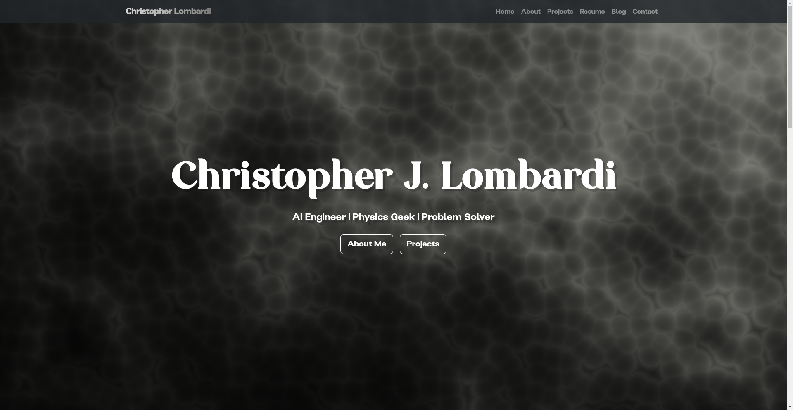

# Portfolio Website

This is my personal portfolio website, showcasing skills, projects, and experience in Applied Physics, Computer Science, and Machine Learning.

  

## Features
- Responsive design optimized for desktop and mobile
- Sections for About Me, Projects, Skills, and Contact
- Clean, modern layout with custom fonts and styling
- Links to GitHub, LinkedIn, and social media profiles

## Monitoring with Prometheus & Grafana

I instrumented the Flask app to expose metrics (response time, request count, view count per page, total visitors) at `/metrics`.  
Prometheus scrapes these metrics and Grafana visualizes them in real-time dashboards.  

This was done to demonstrate practical DevOps skills, including monitoring and observability.

[View Grafana Dashboard](https://clombardi23.grafana.net/d/a885c9d2-90fc-4f7f-9a57-8237295ce7c5/portfolio-dashboard?orgId=1&from=2025-08-20T11%3A24%3A58.305Z&to=2025-08-20T23%3A24%3A58.305Z&timezone=browser&src=hg_notification_trial)

## Technologies Used
- HTML5, CSS3, JavaScript
- Bootstrap 5 for responsive layout
- Flask for backend routing and templating
